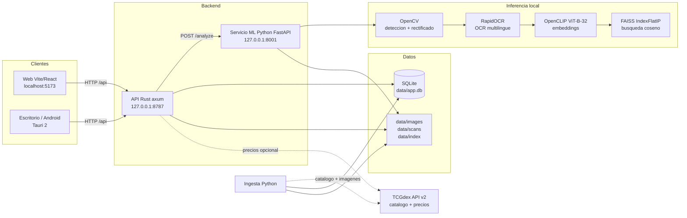

# PokemonCardDetector

Escanea cartas Pokemon con el movil o el escritorio, identificalas en segundos con modelos preentrenados que corren **100% en local**, consulta su informacion y precio estimado, y guardalas en tu coleccion personal.

- Sin nube, sin cuentas, sin coste: la inferencia (deteccion, OCR, embeddings y busqueda) se ejecuta en tu maquina.
- Catalogo multiidioma (en, es, fr, de, it, pt) descargado de la API gratuita de [TCGdex](https://tcgdex.dev).
- Cero entrenamiento de modelos: todo el pipeline usa modelos preentrenados (RapidOCR, OpenCLIP) y vision clasica (OpenCV).

## Arquitectura



- **API Rust (axum, puerto 8787)**: API publica, persistencia SQLite (migraciones al arrancar), servido de imagenes estaticas y conector de precios desacoplado (`PriceProvider`).
- **Servicio ML (FastAPI, puerto 8001)**: servicio interno de inferencia. Detecta la carta (OpenCV), lee texto (RapidOCR), calcula el embedding (OpenCLIP) y busca los 5 candidatos mas parecidos en FAISS.
- **Ingesta (Python)**: descarga catalogo e imagenes oficiales de TCGdex a SQLite y `data/images/`, y construye el indice FAISS.
- **Web (Vite/React)** y **escritorio/Android (Tauri 2)**: clientes que consumen la API publica.
- **SQLite compartida en `data/`**: una sola fuente de verdad para catalogo, escaneos, coleccion y cache de precios.

## Estructura de carpetas

```
PokemonCardDetector/
├── apps/
│   ├── web/            # Cliente web (Vite + React), dev en :5173
│   └── desktop/        # Envoltorio Tauri 2 (escritorio y Android)
├── services/
│   ├── api/            # API publica Rust (axum + sqlx), puerto 8787
│   │   └── migrations/ # 0001_init.sql: unico propietario del esquema SQL
│   └── ml/             # Servicio ML FastAPI (puerto 8001) + ingesta del catalogo
├── data/               # Datos locales (NO se versiona, salvo .gitkeep)
│   ├── app.db          # SQLite compartida (la crea la API al arrancar)
│   ├── images/         # Imagenes oficiales del catalogo ({card_id}.png)
│   ├── scans/          # Fotos subidas por el usuario ({scan_id}.jpg)
│   └── index/          # faiss.index + cards.json (mapa fila -> carta)
├── docs/
│   └── ARCHITECTURE.md # Documento de referencia completo
├── scripts/
│   ├── dev.ps1         # Arranca API + ML + web en ventanas separadas (Windows)
│   └── ingest.ps1      # Ingesta de catalogo + construccion del indice
├── docker-compose.yml  # Alternativa con contenedores (api + ml)
├── .env.example        # Variables de entorno documentadas
└── README.md
```

## Quickstart (Windows)

Prerequisitos: [Rust](https://rustup.rs) (cargo), Python 3.10+, Node.js 18+.

Sigue los pasos **en este orden** (la API crea la base de datos que la ingesta rellena despues):

```powershell
# 1) API Rust: crea data/app.db con el esquema y deja la API escuchando en :8787
cd services/api
cargo run

# 2) (en otra terminal) Entorno Python del servicio ML
cd services/ml
python -m venv .venv
.\.venv\Scripts\Activate.ps1
pip install -r requirements.txt

# 3) Ingesta del catalogo (ejemplo acotado para probar rapido; usa --all para todo)
python -m ingest.ingest_catalog --langs en es --sets base1 swsh3

# 4) Construye el indice FAISS a partir de las imagenes descargadas
python -m ingest.build_index

# 5) Arranca el servicio ML
uvicorn app.main:app --port 8001

# 6) (en otra terminal) Cliente web
cd apps/web
npm install
npm run dev
# Abre http://localhost:5173
```

Atajo: `scripts/dev.ps1` arranca API, ML y web en ventanas separadas, y `scripts/ingest.ps1 --langs en es --sets base1 swsh3` ejecuta la ingesta completa (catalogo + indice).

## Escritorio y Android

La app de escritorio y la de Android comparten un unico codigo base con Tauri 2, reutilizando el frontend web. Instrucciones de compilacion y firma en [`apps/desktop/README.md`](apps/desktop/README.md).

## Alternativa con Docker

```powershell
docker compose up --build
```

Levanta la API en `http://localhost:8787` y el servicio ML en `http://localhost:8001`, compartiendo `./data` como volumen. Los `Dockerfile` viven en `services/api` y `services/ml`. La ingesta del catalogo se ejecuta aparte (paso 3 del quickstart o `scripts/ingest.ps1`).

## Configuracion

Copia `.env.example` a `.env` y ajusta lo que necesites:

| Variable | Default | Descripcion |
|---|---|---|
| `API_PORT` | `8787` | Puerto de la API Rust |
| `ML_PORT` | `8001` | Puerto del servicio ML |
| `ML_SERVICE_URL` | `http://127.0.0.1:8001` | URL del ML vista desde la API |
| `DATABASE_PATH` | `./data/app.db` | Ruta de la base SQLite (relativa a la raiz del repo) |
| `DATA_DIR` | `./data` | Raiz de datos: imagenes, scans, indice (relativa a la raiz del repo) |
| `PRICE_PROVIDER` | `null` | Proveedor de precios: `null` o `tcgdex` |
| `VITE_API_URL` | `http://localhost:8787` | URL de la API vista desde la web (ver nota) |

> **Nota:** `VITE_API_URL` **no** se lee del `.env` de la raiz: Vite solo carga los `.env` de `apps/web`. Definela en `apps/web/.env` (partiendo de `apps/web/.env.example`).

## Privacidad

Todo corre en tu maquina. Las fotos que haces a tus cartas **nunca salen de tu equipo**: se guardan en `data/scans/` y se procesan en local. La unica salida a internet es la descarga del catalogo y las imagenes oficiales desde TCGdex y, si activas `PRICE_PROVIDER=tcgdex`, la consulta opcional de precios (con cache local de 24 horas). No hay telemetria, ni cuentas, ni servicios de pago.

## Licencia

MIT. Ver [LICENSE](LICENSE).
