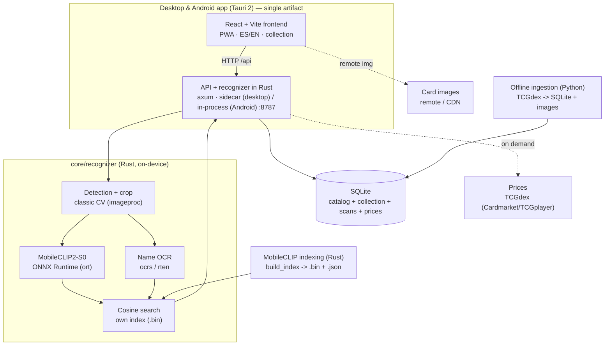

# CardLens

> A **self-contained**, **on-device** Pokémon TCG card scanner. (Repository: PokemonCardDetector.)

Point your camera or upload a photo and CardLens identifies the card in ~0.3 s,
**100% on your device** (no cloud, no accounts, no Python at runtime), shows its
details and lets you save it to your personal collection.

> **Disclaimer:** unofficial, non-commercial project. Not affiliated with or
> endorsed by Nintendo, The Pokémon Company, Creatures or GAME FREAK. "Pokémon",
> the card names and their images are trademarks and © of their respective
> owners; they are used solely for identification purposes.

## What it does

- **On-device recognition in Rust** (no Python at runtime): detects and crops the
  card (classic computer vision), computes the visual embedding with
  **MobileCLIP2-S0** (ONNX Runtime), reads the **name via OCR** (`ocrs`/`rten`) and
  searches by **cosine similarity**. OCR reinforces the result to disambiguate
  look-alike artworks.
- **Desktop and Android, one codebase**: on desktop the API ships as a *sidecar*
  binary that starts and stops with the app; on Android (which can't spawn a
  sidecar) the **same API runs in-process**. Recognition is 100% on-device on both.
- **Collection**: save cards (no duplicates), with **tags** and **filters**
  (set / rarity / type / language / search), and **JSON import/export**.
- **Prices**: per-card market prices (Cardmarket EUR + TCGplayer USD) via TCGdex,
  cached locally for 24 h. Requires internet (recognition does not).
- **Multilingual** (ES/EN) UI; multilingual catalog from [TCGdex](https://tcgdex.dev).
- **Private**: your photos never leave your device. The only things that go to the
  internet are downloading the catalog, showing the card images (remote / CDN) and,
  optionally, prices.
- **Zero training**: the whole pipeline uses pretrained models.

## Architecture

The runtime is **100% Rust**. On desktop the Tauri 2 app launches the API as a
sidecar binary; on Android it runs the same API **in-process**. The API **embeds
the recognizer** (`core/recognizer`) and resolves scans locally. Python only runs
**offline** for catalog ingestion.



- **Tauri 2 app (desktop & Android):** on desktop, a single executable that on
  launch starts the sidecar API and stops it on exit. On Android a sidecar isn't
  possible, so the **same API runs in-process** (a thread with its own tokio
  runtime); the models/index/DB travel as assets inside the APK and are extracted
  to private storage on first launch. Both reuse the bundled web frontend.
- **Rust API (axum, :8787):** public API, SQLite persistence (migrations on
  startup), static file serving and a decoupled price connector (`PriceProvider`).
  It **embeds the recognizer**: `/api/scan` runs detection + embedding + OCR + search.
- **core/recognizer (Rust):** shared inference core (desktop and Android).
  Bounding-box crop detector, MobileCLIP embedder via ONNX Runtime, OCR via
  `ocrs`/`rten` and a cosine-similarity index in pure Rust.
- **Ingestion (Python, offline):** downloads the catalog and images from TCGdex
  into SQLite and prepares the card list; a Rust binary (`build_index`) computes the
  MobileCLIP index. Python **does not run** during normal app use.
- **SQLite (`data/app.db`):** single source of truth for catalog, collection, tags,
  scans and cached prices.

## Folder structure

```
PokemonCardDetector/
├── apps/
│   ├── web/             # Web client (Vite + React), i18n ES/EN, dev on :5173
│   └── desktop/         # Tauri 2 app (desktop + Android). Sidecar on desktop,
│       └── src-tauri/   #   in-process API on Android. lib.rs, tauri.conf.json, gen/android
├── core/
│   └── recognizer/      # Rust inference core (detection, MobileCLIP, OCR, search)
│       └── src/bin/build_index.rs   # Builds the MobileCLIP index from the catalog
├── services/
│   ├── api/             # Rust public API (axum + sqlx + recognizer), :8787
│   │   └── migrations/  # 0001 schema · 0002 tags · 0003 anti-duplicates
│   └── ml/              # Python: ONLY offline catalog ingestion. Not run at runtime
├── models/              # Downloaded models (gitignored): MobileCLIP2-S0, OCR (ocrs)
├── runtime/             # onnxruntime.dll for development (gitignored)
├── data/                # Local data (gitignored except .gitkeep): app.db, images, scans, index
│   └── index/           # mobileclip.bin + mobileclip_cards.json (runtime index)
├── docs/                # ARCHITECTURE.md (desktop) and ARCHITECTURE-MOBILE.md (Android)
├── scripts/             # dev.ps1, ingest.ps1, stage-desktop-resources.ps1, stage-android-resources.ps1, upload_*.py
└── README.md
```

## Development quickstart (Windows)

Prerequisites: [Rust](https://rustup.rs) (cargo), Python 3.10+, Node.js 18+.

**1) Models** (once). Download into `models/` and `runtime/`:
- MobileCLIP2-S0 ONNX (image encoder) -> `models/mobileclip2_s0/vision_model.onnx`
- OCR `ocrs` -> `models/ocrs/text-detection.rten` and `text-recognition.rten`
- ONNX Runtime 1.22 (Windows x64) `onnxruntime.dll` -> `runtime/ort/onnxruntime.dll`

**2) Schema + catalog:**
```powershell
cd services/api; cargo run        # creates data/app.db and serves the API on :8787 (Ctrl+C after the schema is created)
cd services/ml
python -m venv .venv; .\.venv\Scripts\Activate.ps1
pip install -r requirements.txt
python -m ingest.ingest_catalog --langs en es --all   # catalog + images (takes a while)
python -m ingest.build_index                            # prepares data/index/cards.json
```

**3) MobileCLIP index (runtime):**
```powershell
cd core/recognizer
$env:ORT_DYLIB_PATH = "..\..\runtime\ort\onnxruntime.dll"
cargo run --release --bin build_index --features "onnx desktop-dynamic"
```

**4) Run the API (Rust) and the web app:**
```powershell
cd services/api
$env:ORT_DYLIB_PATH = "..\..\runtime\ort\onnxruntime.dll"
cargo run                          # API + recognizer on :8787

cd apps/web; npm install; npm run dev   # http://localhost:5173
```

> Note: dependencies are compiled optimized even in development builds
> (`[profile.dev.package."*"]`) so OCR (pure Rust) stays fast.

## Standalone desktop app

The packaged executable starts the API by itself (nothing to launch):

```powershell
# 1) prepare the sidecar and resources (model, index, OCR, DLL, DB) for the bundle
powershell -File scripts/stage-desktop-resources.ps1
# 2) build the installer
cd apps/desktop; npm install; npm run tauri build
```

This produces the portable executable and the NSIS installer
(`CardLens_..._x64-setup.exe`) in `apps/desktop/src-tauri/target/release/`. Details
and Android notes in [`apps/desktop/README.md`](apps/desktop/README.md).

## Android app (on-device)

The **same** Tauri app runs on Android with 100% on-device recognition (no server):
the axum API runs **in-process** and the models/index/DB travel inside the APK,
extracted to private storage on first launch. Requirements: Android SDK
(platform 34+, build-tools, platform-tools), **NDK r26+**, JDK 17, `cargo-ndk` and
the Rust Android targets. Environment: `ANDROID_HOME`, `NDK_HOME`, `JAVA_HOME`.

```powershell
# 1) Rust Android targets (once) + cargo-ndk
rustup target add aarch64-linux-android armv7-linux-androideabi i686-linux-android x86_64-linux-android
cargo install cargo-ndk

# 2) stage the native/heavy APK resources (libonnxruntime.so + models/index/DB)
#    Needs runtime/ort/android/<abi>/libonnxruntime.so (extracted from the AAR
#    com.microsoft.onnxruntime:onnxruntime-android) and the models/index/DB (see Quickstart).
powershell -File scripts/stage-android-resources.ps1 -Abis arm64-v8a,armeabi-v7a,x86,x86_64

# 3) build the APK and install on a device/emulator
cd apps/desktop
npm run tauri -- android build --apk          # release (signed if keystore.properties exists)
$adb = "$env:LOCALAPPDATA\Android\Sdk\platform-tools\adb.exe"
& $adb install -r src-tauri/gen/android/app/build/outputs/apk/universal/release/app-universal-release.apk
```

The Gradle project (`src-tauri/gen/android`) is versioned with its customizations
(camera permission, `noCompress` for the large assets, and `MainActivity` extracting
the resources on first launch). The official `libonnxruntime.so` is loaded
**dynamically** at runtime (not linked at build time). Release builds are signed via
`gen/android/keystore.properties` (gitignored) and aligned to 16 KB pages for
64-bit ABIs (Play requirement for Android 15+).

## Configuration

Variables (`.env` at the root for the API; `apps/web/.env` for the web app):

| Variable | Default | Description |
|---|---|---|
| `API_PORT` | `8787` | Rust API port |
| `DATABASE_PATH` | `<repo>/data/app.db` | SQLite database (relative to the repo root) |
| `DATA_DIR` | `<repo>/data` | Data root: scans, index |
| `ORT_DYLIB_PATH` | — | Path to `onnxruntime.dll` (needed in development) |
| `MODEL_PATH` | `models/mobileclip2_s0/vision_model.onnx` | Visual ONNX encoder |
| `INDEX_BIN_PATH` / `INDEX_CARDS_PATH` | `data/index/mobileclip.*` | Runtime index |
| `OCR_DET_PATH` / `OCR_REC_PATH` | `models/ocrs/*.rten` | OCR models |
| `SEARCH_K` / `TOP_K` | `30` / `5` | Candidates retrieved / returned |
| `W_OCR` | `0.35` | OCR reinforcement weight (additive bonus) |
| `CONF_THRESHOLD` / `MARGIN_THRESHOLD` | `0.80` / `0.05` | Low-confidence thresholds |
| `PRICE_PROVIDER` | `tcgdex` | Price provider: `tcgdex` or `null` (disabled) |
| `VITE_API_URL` | `http://localhost:8787` | API URL as seen from the web app (in `apps/web/.env`) |
| `VITE_IMAGE_BASE` | — | Own image CDN (`.../catalog`); if omitted, uses the catalog's remote image |

## Privacy

All recognition runs on your machine. Your card photos **never leave your device**:
they are stored locally and processed in-process. The only network egress is
downloading the catalog, showing the card images and, optionally, prices (TCGdex,
with a local cache). No telemetry, no accounts, no paid services.

## License

MIT. Copyright (c) 2026 Alejandro Aranda. See [LICENSE](LICENSE).
