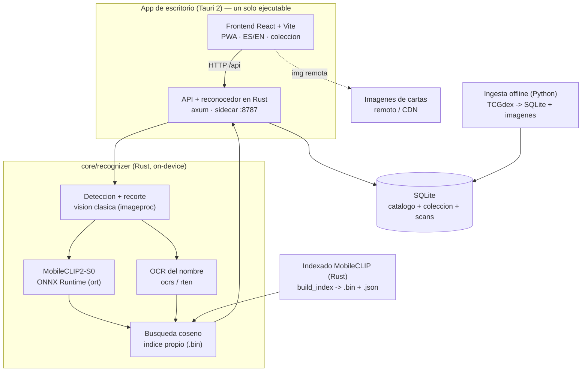

# CardLens

> Escaner de cartas Pokemon TCG, **self-contained** y **on-device**. (Repositorio: PokemonCardDetector.)

Apunta con la camara o sube una foto y CardLens identifica la carta en ~0,3 s
**100% en tu dispositivo** (sin nube, sin cuentas, sin Python en ejecucion),
te muestra su informacion y la guardas en tu coleccion personal.

> **Aviso:** proyecto no oficial, sin animo de lucro. No afiliado ni respaldado por
> Nintendo, The Pokemon Company, Creatures ni GAME FREAK. «Pokemon», los nombres de
> las cartas y sus imagenes son marcas y © de sus respectivos propietarios; se usan
> unicamente con fines identificativos.

## Que hace

- **Reconocimiento on-device en Rust** (sin Python en ejecucion): detecta y recorta
  la carta (vision clasica), calcula el embedding visual con **MobileCLIP2-S0** (ONNX
  Runtime), lee el **nombre por OCR** (`ocrs`/`rten`) y busca por **similitud coseno**.
  El OCR refuerza el resultado para desambiguar artes parecidos.
- **Escritorio autonomo**: abres el ejecutable y arranca todo solo — la API va
  empaquetada como *sidecar* y se cierra al salir. Un instalador, sin dependencias
  externas en ejecucion.
- **Coleccion**: guarda cartas (sin duplicados), **etiquetas** y **filtros**
  (set / rareza / tipo / idioma / buscar), e **import/export en JSON**.
- **Multiidioma** (ES/EN) en la interfaz; catalogo multilingue de [TCGdex](https://tcgdex.dev).
- **Privado**: las fotos nunca salen de tu equipo. Lo unico que viaja a internet es
  descargar el catalogo y mostrar las imagenes de las cartas (remotas / CDN).
- **Cero entrenamiento**: todo el pipeline usa modelos preentrenados.

## Arquitectura

El runtime es **100% Rust**. La app de escritorio (Tauri 2) arranca la API como
binario sidecar; la API **embebe el reconocedor** (`core/recognizer`) y resuelve el
escaneo en proceso. Python solo interviene **offline** para la ingesta del catalogo.



- **App Tauri 2 (escritorio y Android):** en escritorio, un solo ejecutable que al
  abrirse lanza la API como *sidecar* y la cierra al salir. En Android no se puede
  lanzar un sidecar, asi que la **misma API corre en proceso** (hilo + runtime tokio)
  dentro de la app; los modelos/indice/DB viajan como assets en la APK y se extraen al
  almacenamiento privado en el primer arranque. Reconocimiento 100% on-device en ambos.
- **API en Rust (axum, :8787):** API publica, persistencia SQLite (migraciones al
  arrancar), servido de estaticos y conector de precios desacoplado (`PriceProvider`).
  **Embebe el reconocedor**: `/api/scan` hace deteccion + embedding + OCR + busqueda.
- **core/recognizer (Rust):** nucleo de inferencia compartido (escritorio y Android).
  Detector por recorte (bounding box), embedder MobileCLIP via ONNX Runtime,
  OCR via `ocrs`/`rten` e indice de similitud coseno en Rust puro.
- **Ingesta (Python, offline):** descarga el catalogo e imagenes de TCGdex a SQLite y
  prepara la lista de cartas; un binario Rust (`build_index`) calcula el indice
  MobileCLIP. Python **no se ejecuta** durante el uso normal de la app.
- **SQLite (`data/app.db`):** unica fuente de verdad de catalogo, coleccion, etiquetas y scans.

## Estructura de carpetas

```
PokemonCardDetector/
├── apps/
│   ├── web/             # Cliente web (Vite + React), i18n ES/EN, dev en :5173
│   └── desktop/         # App Tauri 2 (escritorio + Android). Sidecar en escritorio,
│       └── src-tauri/   #   API en proceso en Android. lib.rs, tauri.conf.json, gen/android
├── core/
│   └── recognizer/      # Nucleo de inferencia en Rust (deteccion, MobileCLIP, OCR, busqueda)
│       └── src/bin/build_index.rs   # Construye el indice MobileCLIP del catalogo
├── services/
│   ├── api/             # API publica Rust (axum + sqlx + recognizer), :8787
│   │   └── migrations/  # 0001 esquema · 0002 etiquetas · 0003 anti-duplicados
│   └── ml/              # Python: SOLO ingesta del catalogo (offline). No corre en runtime
├── models/              # Modelos descargados (gitignored): MobileCLIP2-S0, OCR (ocrs)
├── runtime/             # onnxruntime.dll para desarrollo (gitignored)
├── data/                # Datos locales (gitignored salvo .gitkeep): app.db, images, scans, index
│   └── index/           # mobileclip.bin + mobileclip_cards.json (indice de runtime)
├── docs/                # ARCHITECTURE.md (escritorio) y ARCHITECTURE-MOBILE.md (plan Android)
├── scripts/             # dev.ps1, ingest.ps1, stage-desktop-resources.ps1, upload_*.py
└── README.md
```

## Quickstart de desarrollo (Windows)

Prerequisitos: [Rust](https://rustup.rs) (cargo), Python 3.10+, Node.js 18+.

**1) Modelos** (una vez). Descarga a `models/` y `runtime/`:
- MobileCLIP2-S0 ONNX (encoder de imagen) -> `models/mobileclip2_s0/vision_model.onnx`
- OCR `ocrs` -> `models/ocrs/text-detection.rten` y `text-recognition.rten`
- ONNX Runtime 1.22 (Windows x64) `onnxruntime.dll` -> `runtime/ort/onnxruntime.dll`

**2) Esquema + catalogo:**
```powershell
cd services/api; cargo run        # crea data/app.db y deja la API en :8787 (Ctrl+C tras crear el esquema)
cd services/ml
python -m venv .venv; .\.venv\Scripts\Activate.ps1
pip install -r requirements.txt
python -m ingest.ingest_catalog --langs en es --all   # catalogo + imagenes (tarda)
python -m ingest.build_index                            # prepara data/index/cards.json
```

**3) Indice MobileCLIP (runtime):**
```powershell
cd core/recognizer
$env:ORT_DYLIB_PATH = "..\..\runtime\ort\onnxruntime.dll"
cargo run --release --bin build_index --features "onnx desktop-dynamic"
```

**4) Arranca la API (Rust) y la web:**
```powershell
cd services/api
$env:ORT_DYLIB_PATH = "..\..\runtime\ort\onnxruntime.dll"
cargo run                          # API + reconocedor en :8787

cd apps/web; npm install; npm run dev   # http://localhost:5173
```

> Nota: las dependencias se compilan optimizadas incluso en build de desarrollo
> (`[profile.dev.package."*"]`) para que el OCR (Rust puro) vaya rapido.

## App de escritorio autonoma

El ejecutable empaquetado arranca la API el solo (no hay que lanzar nada):

```powershell
# 1) prepara el sidecar y los recursos (modelo, indice, OCR, DLL, DB) para el bundle
powershell -File scripts/stage-desktop-resources.ps1
# 2) construye el instalable
cd apps/desktop; npm install; npm run tauri build
```

Genera el ejecutable portable y el instalador NSIS (`CardLens_..._x64-setup.exe`) en
`apps/desktop/src-tauri/target/release/`. Detalles y notas de Android en
[`apps/desktop/README.md`](apps/desktop/README.md).

## App Android (on-device)

La **misma** app Tauri corre en Android con reconocimiento 100% on-device (sin
servidor): la API axum se ejecuta **en proceso** y los modelos/indice/DB viajan dentro
de la APK y se extraen al almacenamiento privado en el primer arranque. Requisitos:
Android SDK (plataforma 34+, build-tools, platform-tools), **NDK r26+**, JDK 17,
`cargo-ndk` y los targets Rust de Android. Variables de entorno: `ANDROID_HOME`,
`NDK_HOME`, `JAVA_HOME`.

```powershell
# 1) targets Rust de Android (una vez) + cargo-ndk
rustup target add aarch64-linux-android armv7-linux-androideabi i686-linux-android x86_64-linux-android
cargo install cargo-ndk

# 2) prepara los recursos nativos/pesados de la APK (libonnxruntime.so + modelos/indice/DB)
#    Necesita runtime/ort/android/<abi>/libonnxruntime.so (extraido del AAR
#    com.microsoft.onnxruntime:onnxruntime-android) y los modelos/indice/DB (ver Quickstart).
powershell -File scripts/stage-android-resources.ps1 -Abis arm64-v8a

# 3) compila la APK e instala en el dispositivo/emulador
cd apps/desktop
npm run tauri -- android build --debug --apk --target aarch64
$adb = "$env:LOCALAPPDATA\Android\Sdk\platform-tools\adb.exe"
& $adb install -r src-tauri/gen/android/app/build/outputs/apk/universal/debug/app-universal-debug.apk
```

El proyecto Gradle (`src-tauri/gen/android`) esta versionado con sus personalizaciones
(permiso de camara, `noCompress` para los assets grandes, y `MainActivity` que extrae
los recursos en el primer arranque). La `libonnxruntime.so` oficial se carga
**dinamicamente** en runtime (no se enlaza en compilacion). Para publicar en release
hacen falta firma y, en ABIs de 64 bits, alineacion de paginas a 16 KB (el NDK r28+ la
aplica por defecto; con r26/r27 hay que pasar `-Wl,-z,max-page-size=16384`).

## Configuracion

Variables (`.env` en la raiz para la API; `apps/web/.env` para la web):

| Variable | Default | Descripcion |
|---|---|---|
| `API_PORT` | `8787` | Puerto de la API Rust |
| `DATABASE_PATH` | `<repo>/data/app.db` | Base SQLite (relativa a la raiz del repo) |
| `DATA_DIR` | `<repo>/data` | Raiz de datos: scans, indice |
| `ORT_DYLIB_PATH` | — | Ruta a `onnxruntime.dll` (necesaria en desarrollo) |
| `MODEL_PATH` | `models/mobileclip2_s0/vision_model.onnx` | Encoder visual ONNX |
| `INDEX_BIN_PATH` / `INDEX_CARDS_PATH` | `data/index/mobileclip.*` | Indice de runtime |
| `OCR_DET_PATH` / `OCR_REC_PATH` | `models/ocrs/*.rten` | Modelos OCR |
| `SEARCH_K` / `TOP_K` | `30` / `5` | Candidatos recuperados / devueltos |
| `W_OCR` | `0.35` | Peso del refuerzo OCR (bonus aditivo) |
| `CONF_THRESHOLD` / `MARGIN_THRESHOLD` | `0.80` / `0.05` | Umbrales de confianza baja |
| `PRICE_PROVIDER` | `null` | Proveedor de precios: `null` o `tcgdex` |
| `VITE_API_URL` | `http://localhost:8787` | URL de la API vista desde la web (en `apps/web/.env`) |
| `VITE_IMAGE_BASE` | — | CDN propio de imagenes (`.../catalog`); si se omite, usa la imagen remota del catalogo |

## Privacidad

Todo el reconocimiento corre en tu maquina. Las fotos de tus cartas **nunca salen de
tu equipo**: se guardan en local y se procesan en proceso. La unica salida a internet
es la descarga del catalogo, mostrar las imagenes de las cartas y, opcionalmente, los
precios (`PRICE_PROVIDER=tcgdex`, con cache local). Sin telemetria, sin cuentas, sin
servicios de pago.

## Licencia

MIT. Copyright (c) 2026 Alejandro Aranda. Ver [LICENSE](LICENSE).
